# 🚀 AWS Event-Driven File Upload Platform

<p align="center">
  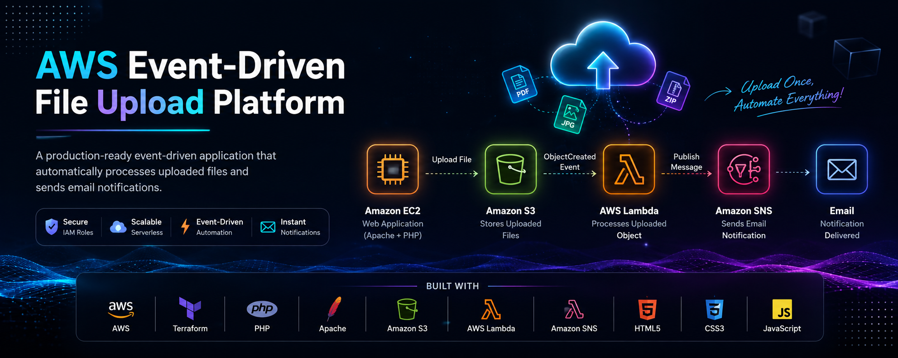
</p>

<p align="center">
A production-ready event-driven file upload platform built on <b>AWS</b> using <b>Terraform</b>, <b>Amazon EC2</b>, <b>Amazon S3</b>, <b>AWS Lambda</b>, and <b>Amazon SNS</b>.
</p>

<p align="center">


</p>

<p align="center">


</p>

---

## 📑 Table of Contents

- [📖 Project Overview](#-project-overview)
- [🎯 Key Features](#-key-features)
- [🏗 Architecture](#-architecture)
- [⚙ AWS Services Used](#-aws-services-used)
- [📁 Project Structure](#-project-structure)
- [🚀 Deployment Guide](#-deployment-guide)
- [📸 Project Screenshots](#-project-screenshots)
- [📤 Upload Workflow](#-upload-workflow)
- [🔐 Security](#-security)
- [🧰 Technologies Used](#-technologies-used)
- [📚 Learning Outcomes](#-learning-outcomes)
- [🔮 Future Improvements](#-future-improvements)
- [👨‍💻 Author](#-author)
- [📄 License](#-license)

---

# 📖 Project Overview

Modern cloud applications rarely perform every task synchronously.

Instead of handling file processing directly inside the web application, cloud-native systems use **event-driven architectures** where cloud services automatically communicate with each other whenever an event occurs.

This project demonstrates a complete **production-style Event-Driven File Upload Platform** built entirely on AWS.

A responsive PHP web application hosted on **Amazon EC2** allows users to upload files through a modern drag-and-drop interface.

Every uploaded file is securely stored in **Amazon S3**.

Whenever a new object is created inside the S3 bucket, an **ObjectCreated Event** automatically triggers an **AWS Lambda** function.

The Lambda function processes the uploaded object, extracts its metadata, and publishes a notification to an **Amazon SNS Topic**.

Amazon SNS then delivers an email notification to every subscribed user without requiring any manual intervention.

The complete cloud infrastructure is provisioned using **Terraform**, making the deployment fully reproducible, version-controlled, and Infrastructure-as-Code (IaC) driven.

This project demonstrates how multiple AWS services can be integrated to build scalable, loosely coupled, event-driven cloud applications following modern cloud architecture principles.

---

# 🎯 Key Features

- 🚀 Event-Driven Cloud Architecture
- ☁ Infrastructure Provisioned with Terraform
- 🖥 PHP Web Application Hosted on Amazon EC2
- 📂 Secure File Storage using Amazon S3
- ⚡ Automatic AWS Lambda Invocation
- 📧 Email Notifications using Amazon SNS
- 🔐 IAM Role Authentication (No Hardcoded AWS Credentials)
- 🎨 Modern Glassmorphism User Interface
- 📱 Responsive Design
- 📤 Drag & Drop File Upload
- 📊 Live Upload Progress Bar
- ⚙ AJAX-Based Uploads
- 🛡 Server-Side File Validation
- 🔄 Fully Automated Cloud Workflow
- 📚 Clean and Modular Project Structure

---

# 🌟 Why This Project?

This project was designed to demonstrate practical experience with:

- Event-Driven Architectures
- Infrastructure as Code (IaC)
- AWS Compute Services
- AWS Storage Services
- AWS Serverless Computing
- Cloud Automation
- Secure IAM Practices
- Modern Web Development
- Production Deployment Workflows
- Terraform Module Design

Unlike basic file upload applications, this project showcases how modern cloud-native systems automatically react to events without requiring direct communication between individual services.

The architecture follows AWS best practices by keeping each service independent, scalable, and loosely coupled.

---
# 🏗 Architecture

The platform follows an **event-driven architecture**, where cloud services communicate automatically using events instead of direct application calls.

Whenever a user uploads a file, Amazon S3 emits an **ObjectCreated** event that automatically invokes an AWS Lambda function. Lambda processes the uploaded object and publishes a notification to Amazon SNS, which delivers an email to subscribed users.

This loosely coupled architecture improves scalability, reliability, and maintainability while reducing operational complexity.

```text
                         +----------------------+
                         |        User          |
                         +----------+-----------+
                                    |
                                    | Upload File
                                    ▼
                     +-------------------------------+
                     |  Amazon EC2 (Apache + PHP)    |
                     |  Upload Web Application       |
                     +---------------+---------------+
                                     |
                                     | AWS SDK for PHP
                                     ▼
                         +--------------------------+
                         |      Amazon S3 Bucket    |
                         +------------+-------------+
                                      |
                           ObjectCreated Event
                                      |
                                      ▼
                         +--------------------------+
                         |      AWS Lambda          |
                         |  Process Uploaded File   |
                         +------------+-------------+
                                      |
                              Publish Message
                                      |
                                      ▼
                         +--------------------------+
                         |       Amazon SNS         |
                         +------------+-------------+
                                      |
                                      ▼
                           Email Notification
```

---

# ☁ Architecture Explanation

The workflow begins when a user uploads a supported file using the PHP web application hosted on **Amazon EC2**.

The application securely uploads the file into an **Amazon S3 Bucket** using the AWS SDK for PHP.

Once the upload is complete:

- Amazon S3 automatically generates an **ObjectCreated** event.
- AWS Lambda is invoked without any manual intervention.
- Lambda extracts information about the uploaded object.
- Lambda publishes a message to an Amazon SNS Topic.
- Amazon SNS sends an email notification to every subscribed recipient.

This design eliminates polling and creates a fully automated, event-driven workflow.

---

# ⚙ AWS Services Used

| AWS Service | Purpose in this Project |
|-------------|-------------------------|
| **Amazon EC2** | Hosts the PHP web application using Apache HTTP Server |
| **Amazon S3** | Securely stores uploaded files and generates ObjectCreated events |
| **AWS Lambda** | Automatically processes uploaded files after every S3 event |
| **Amazon SNS** | Sends email notifications whenever Lambda publishes a message |
| **IAM** | Provides secure access to AWS services using IAM Roles |
| **Amazon VPC** | Creates an isolated network for the EC2 instance |
| **Security Groups** | Controls inbound and outbound network traffic |
| **Terraform** | Provisions the complete cloud infrastructure using Infrastructure as Code |

---

# ✨ Core Features

## ☁ Cloud Infrastructure

- Infrastructure as Code using Terraform
- Modular Terraform project structure
- Automated AWS resource provisioning
- Reproducible deployments
- Secure networking with VPC
- IAM Role-based authentication

---

## 🌐 Web Application

- Responsive upload interface
- Glassmorphism design
- Drag-and-drop file uploads
- AJAX-based uploads
- Upload progress bar
- Animated cloud-themed UI
- Mobile-friendly layout

---

## 📂 File Upload System

- Secure file validation
- MIME type verification
- Maximum upload size restriction
- Automatic unique file naming
- Upload metadata generation
- Server-side validation

---

## ⚡ Event-Driven Automation

- Automatic S3 ObjectCreated events
- Serverless Lambda execution
- SNS email notifications
- No manual processing required
- End-to-end automated workflow

---

## 🔐 Security Features

- IAM Roles (No Access Keys)
- Least-Privilege IAM Policies
- Server-Side Validation
- Private S3 Uploads
- Security Groups
- No Hardcoded AWS Credentials

---

# 📁 Project Structure

```text
aws-event-driven-file-upload/
│
├── docs/
│
├── lambda/
│   └── lambda_function.py
│
├── screenshots/
│   ├── banner.jpeg
│   ├── git-clone.png
│   ├── terraform-init.png
│   ├── terraform-apply.png
│   ├── terraform-output.png
│   ├── sns-confirm-email.png
│   ├── sns-confirm-success.png
│   ├── home.png
│   ├── pipeline.png
│   ├── upload-page.png
│   ├── upload-success.png
│   └── sns-email.png
│
├── terraform/
│   ├── provider.tf
│   ├── versions.tf
│   ├── variables.tf
│   ├── outputs.tf
│   ├── terraform.tfvars.example
│   ├── main.tf
│   ├── ip.tf
│   │
│   └── modules/
│       ├── networking/
│       ├── security/
│       ├── iam/
│       ├── ec2/
│       ├── s3/
│       ├── lambda/
│       └── sns/
│
├── website/
│   ├── index.php
│   ├── upload.php
│   ├── script.js
│   ├── style.css
│   ├── composer.json
│   ├── build.sh
│   └── assets/
│       └── aws/
│
└── README.md
```

---

# 🔄 Event Flow

The following sequence illustrates how the application processes every uploaded file:

1. User selects a supported file from the web interface.
2. The PHP application uploads the file to Amazon S3.
3. Amazon S3 stores the object securely.
4. S3 automatically emits an **ObjectCreated** event.
5. AWS Lambda receives the event and executes.
6. Lambda processes the uploaded object.
7. Lambda publishes a message to the Amazon SNS topic.
8. Amazon SNS sends an email notification to subscribed users.
9. The upload workflow completes successfully without any manual intervention.

---
# 🚀 Deployment Guide

Follow the steps below to deploy the complete infrastructure and application on AWS.

The infrastructure is fully provisioned using **Terraform**, while the PHP web application is automatically configured on an Amazon EC2 instance using a bootstrap script.

---

# 📥 Step 1 — Clone the Repository

Clone the repository to your local machine.

```bash
git clone https://github.com/vijayvw/aws-event-driven-file-upload.git

cd aws-event-driven-file-upload
```

### Screenshot

<p align="center">
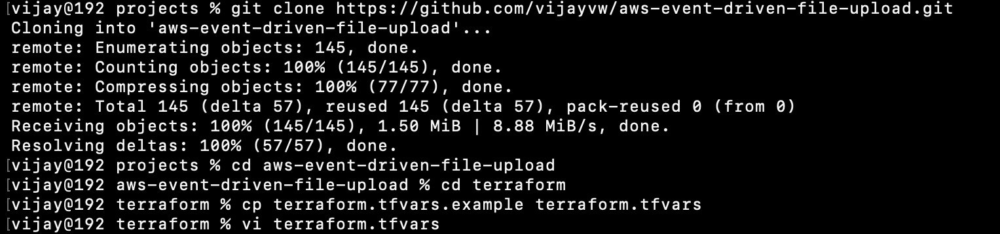
</p>

---

# ⚙ Step 2 — Configure Terraform Variables

Navigate to the Terraform directory.

```bash
cd terraform
```

Copy the example variables file.

```bash
cp terraform.tfvars.example terraform.tfvars
```

Open **terraform.tfvars** and configure your environment.

```hcl
project_name = "aws-file-upload"

aws_region = "us-east-1"

bucket_name = "your-unique-s3-bucket-name"

notification_email = "your-email@example.com"

github_repo = "https://github.com/vijayvw/aws-event-driven-file-upload.git"
```

### Configuration Parameters

| Variable | Description |
|-----------|-------------|
| project_name | Prefix used for AWS resources |
| aws_region | AWS deployment region |
| bucket_name | Globally unique S3 bucket name |
| notification_email | Email address for SNS notifications |
| github_repo | Repository cloned by the EC2 bootstrap script |

---

# 📦 Step 3 — Initialize Terraform

Initialize Terraform and download all required providers.

```bash
terraform init
```

Terraform downloads:

- AWS Provider
- Archive Provider
- HTTP Provider

### Screenshot

<p align="center">
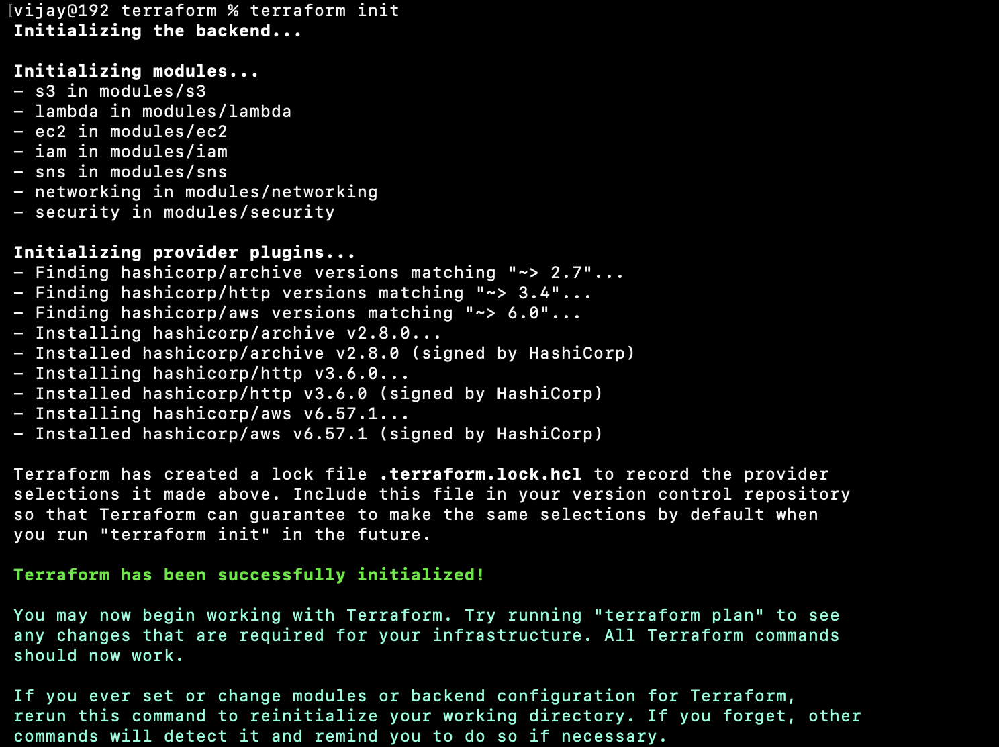
</p>

---

# 🚀 Step 4 — Deploy the Infrastructure

Deploy the complete AWS infrastructure.

```bash
terraform apply
```

Type:

```text
yes
```

or use:

```bash
terraform apply --auto-approve
```

Terraform automatically provisions:

- Amazon VPC
- Public Subnet
- Internet Gateway
- Route Table
- Security Groups
- IAM Roles
- IAM Policies
- EC2 Instance
- Amazon S3 Bucket
- AWS Lambda Function
- Amazon SNS Topic
- SNS Email Subscription

### Screenshot

<p align="center">
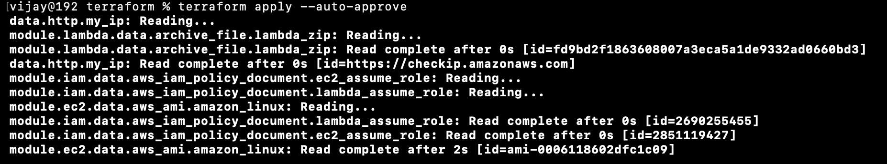
</p>

---

# 📤 Step 5 — Review Terraform Outputs

After the deployment completes successfully, Terraform displays useful outputs such as:

- EC2 Public IP
- Website URL
- S3 Bucket Name
- SNS Topic ARN

Use the EC2 Public IP to access the web application.

### Screenshot

<p align="center">
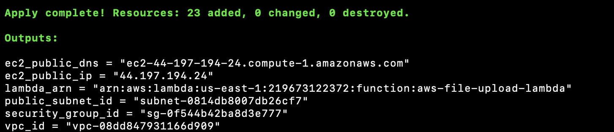
</p>

---

# 📧 Step 6 — Confirm the SNS Subscription

During deployment, Terraform creates an Amazon SNS email subscription using the email address specified in **terraform.tfvars**.

AWS immediately sends a confirmation email.

Open your inbox and click **Confirm Subscription**.

### Screenshot

<p align="center">
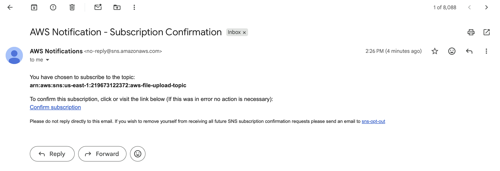
</p>

---

After confirming the subscription, AWS displays a confirmation page indicating that the email address has been successfully subscribed to the SNS topic.

### Screenshot

<p align="center">
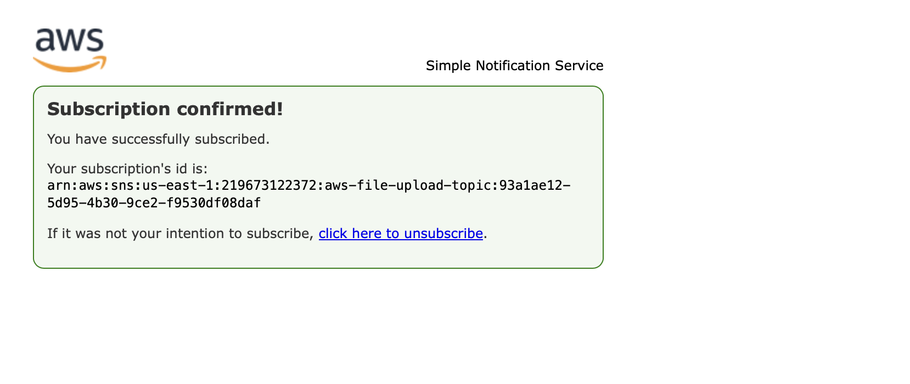
</p>

---

# ✅ Deployment Complete

At this stage, the entire cloud infrastructure is operational.

The following AWS resources have been created successfully:

- ✅ Amazon EC2
- ✅ Amazon S3 Bucket
- ✅ AWS Lambda Function
- ✅ Amazon SNS Topic
- ✅ SNS Email Subscription
- ✅ IAM Roles & Policies
- ✅ Amazon VPC
- ✅ Security Groups

You can now open the **EC2 Public IP** in your browser and start uploading files.

---
# 📸 Project Walkthrough

The following screenshots demonstrate the complete workflow of the application, from accessing the web interface to receiving an automated email notification after a successful file upload.

---

# 🌐 Step 1 — Access the Web Application

After Terraform provisions the infrastructure, open the **EC2 Public IP** displayed in the Terraform outputs.

The application presents a modern cloud-themed landing page that introduces the AWS event-driven architecture and allows users to navigate to the upload section.

### Screenshot

<p align="center">
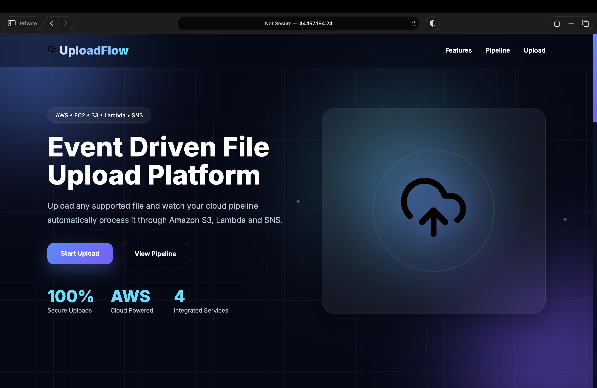
</p>

---

# ☁ Step 2 — View the Cloud Processing Pipeline

The landing page includes a visual representation of the complete cloud workflow.

The diagram illustrates how uploaded files move through AWS services:

- Amazon EC2
- Amazon S3
- AWS Lambda
- Amazon SNS

This helps users understand the underlying event-driven architecture before uploading a file.

### Screenshot

<p align="center">
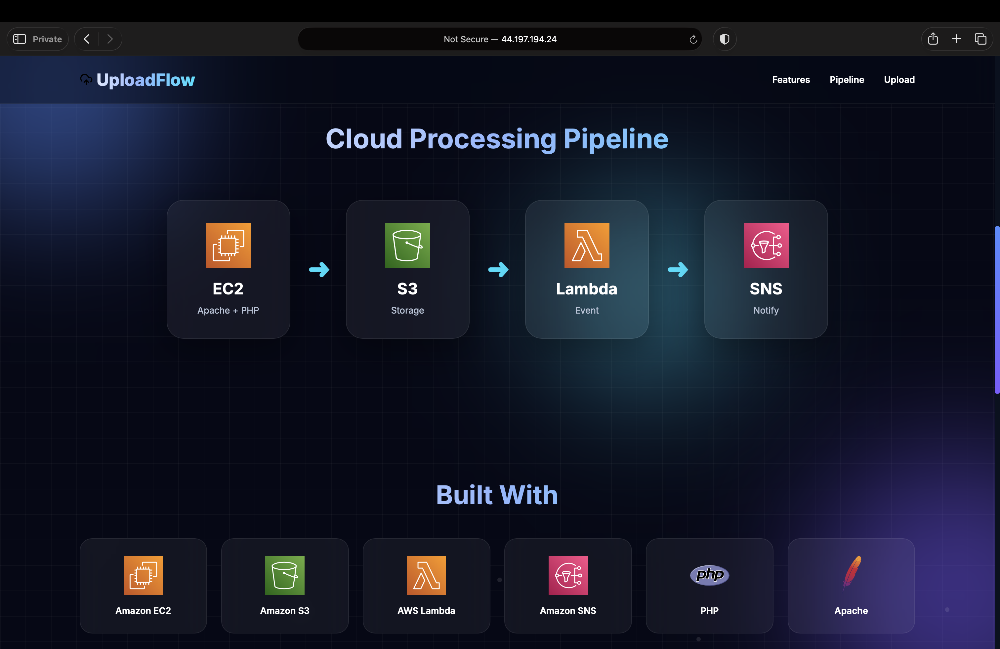
</p>

---

# 📤 Step 3 — Upload a File

Navigate to the upload section and either:

- Drag & Drop a supported file
- Click **Browse Files**
- Select a file from your computer

The application validates the selected file and displays an upload progress indicator.

### Screenshot

<p align="center">
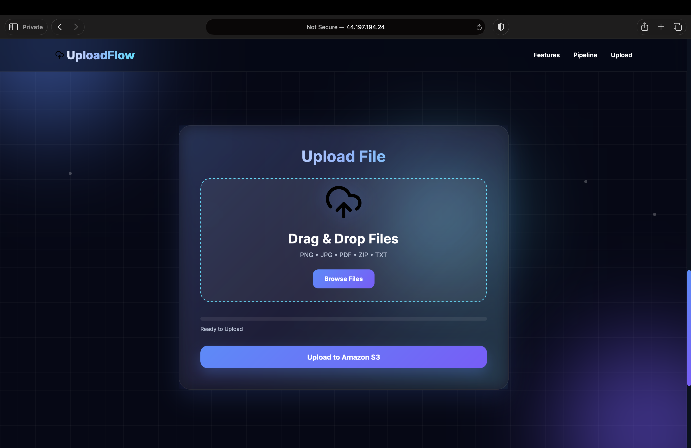
</p>

---

# ✅ Step 4 — File Uploaded Successfully

Once the upload completes successfully, the application displays a confirmation dialog containing details about the uploaded file.

The popup confirms that:

- The file has been uploaded successfully
- The object has been stored in Amazon S3
- AWS Lambda will automatically process the object
- Amazon SNS will send an email notification

### Screenshot

<p align="center">
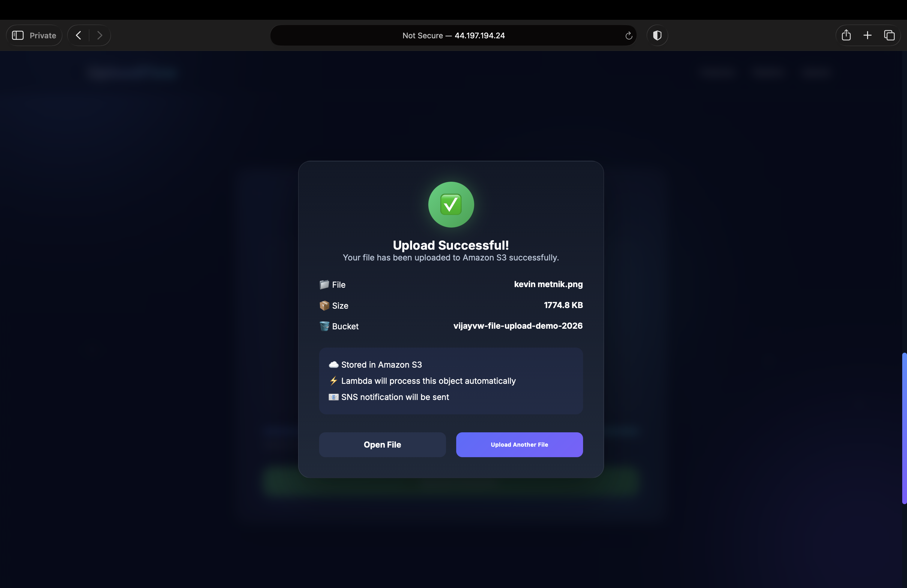
</p>

---

# 📧 Step 5 — Receive the SNS Email Notification

After the file is stored in Amazon S3, an **ObjectCreated** event automatically invokes the AWS Lambda function.

Lambda processes the uploaded object and publishes a notification to the configured Amazon SNS Topic.

Amazon SNS immediately delivers an email notification to every subscribed user.

### Screenshot

<p align="center">
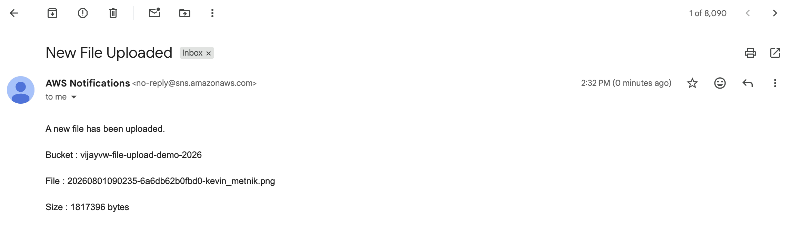
</p>

---

# 🔄 End-to-End Upload Workflow

The complete workflow of the application is fully automated.

```text
User
 │
 │ Select File
 ▼
Upload Web Application
(Amazon EC2)
 │
 │ Upload using AWS SDK
 ▼
Amazon S3 Bucket
 │
 │ ObjectCreated Event
 ▼
AWS Lambda
 │
 │ Process Uploaded File
 ▼
Amazon SNS
 │
 │ Email Notification
 ▼
Subscribed User
```

---

# ⚡ Event-Driven Processing

Unlike traditional applications where the web server performs every operation, this platform follows an event-driven approach.

The PHP application is responsible only for uploading the file to Amazon S3.

After that point:

- Amazon S3 automatically generates an ObjectCreated event.
- AWS Lambda executes without any manual intervention.
- Lambda processes the uploaded object.
- Lambda publishes a message to Amazon SNS.
- Amazon SNS delivers an email notification to subscribers.

This architecture keeps each service independent, scalable, and loosely coupled while eliminating the need for polling or manual processing.

---

# 📦 Supported File Types

The application validates uploaded files before sending them to Amazon S3.

Supported file formats include:

| File Type | Supported |
|-----------|-----------|
| PNG | ✅ |
| JPG / JPEG | ✅ |
| GIF | ✅ |
| PDF | ✅ |
| TXT | ✅ |
| ZIP | ✅ |

### Maximum Upload Size

```text
10 MB
```

---

# 🎨 Frontend Features

The upload interface has been designed to provide a modern user experience.

Features include:

- Responsive Design
- Drag & Drop Upload
- Glassmorphism UI
- Animated Background
- Floating Cloud Animation
- Live Upload Progress Bar
- AJAX-Based Uploads
- Upload Status Popup
- Success & Error Notifications
- Mobile-Friendly Layout
- Smooth Animations

---
# 🔐 Security

Security was a key consideration while designing this project. The platform follows several AWS security best practices to ensure that uploaded files and cloud resources remain protected.

### IAM Security

- IAM Roles are attached to the EC2 instance.
- No AWS Access Keys or Secret Keys are stored in the application.
- AWS SDK automatically retrieves temporary credentials from the EC2 Instance Metadata Service (IMDS).

### Amazon S3 Security

- Files are uploaded to a private Amazon S3 bucket.
- Bucket versioning is enabled to protect against accidental deletion or overwrites.
- Server-side encryption (SSE-S3) encrypts all uploaded objects at rest.
- Object access is controlled through IAM policies.

### Application Security

- Server-side file validation.
- MIME type verification.
- Maximum upload size restriction (10 MB).
- Unique object naming to prevent filename collisions.
- No direct filesystem storage on the EC2 instance.

### Network Security

- Infrastructure deployed inside an Amazon VPC.
- Security Groups restrict inbound traffic.
- Least-privilege access between AWS resources.
- Internet Gateway used only where required.

### Infrastructure Security

- Entire infrastructure managed with Terraform.
- Infrastructure is version-controlled.
- Repeatable deployments eliminate manual configuration errors.

---

# 🧰 Technologies Used

## ☁ Cloud Services

| Technology | Purpose |
|------------|----------|
| Amazon EC2 | Hosts the PHP application |
| Amazon S3 | Object Storage |
| AWS Lambda | Serverless Event Processing |
| Amazon SNS | Email Notifications |
| IAM | Authentication & Authorization |
| Amazon VPC | Network Isolation |
| Security Groups | Firewall Rules |

---

## 🏗 Infrastructure as Code

| Technology | Purpose |
|------------|----------|
| Terraform | AWS Infrastructure Provisioning |

---

## 💻 Backend

| Technology | Purpose |
|------------|----------|
| PHP | Web Application |
| Apache HTTP Server | Web Server |
| AWS SDK for PHP | Upload Files to Amazon S3 |

---

## 🎨 Frontend

| Technology | Purpose |
|------------|----------|
| HTML5 | Page Structure |
| CSS3 | Styling |
| JavaScript | Dynamic User Interface |
| AJAX | Asynchronous File Upload |

---

## 🖥 Operating System

- Amazon Linux
- Linux Command Line

---

# 📚 Learning Outcomes

This project demonstrates hands-on experience with multiple AWS services and modern cloud-native development practices.

### Cloud Computing

- Designing event-driven architectures
- Building serverless workflows
- Working with AWS managed services
- Integrating multiple AWS services

### Infrastructure as Code

- Terraform modules
- Terraform variables
- State management
- Automated infrastructure provisioning

### AWS Services

- Amazon EC2
- Amazon S3
- AWS Lambda
- Amazon SNS
- IAM
- Amazon VPC

### DevOps

- Infrastructure automation
- Repeatable deployments
- Git version control
- Cloud resource management

### Web Development

- PHP application development
- Responsive UI design
- AJAX file uploads
- Client-side validation
- Server-side validation

### Cloud Security

- IAM Roles
- Least Privilege Access
- Secure File Uploads
- Private Object Storage
- Server-Side Encryption

---

# 📈 Project Highlights

✔ Fully Automated Infrastructure Deployment

✔ Event-Driven Cloud Architecture

✔ Serverless Processing using AWS Lambda

✔ Modern Responsive User Interface

✔ Secure File Upload System

✔ Infrastructure as Code with Terraform

✔ Automated Email Notifications

✔ Modular Terraform Project Structure

✔ Production-Style Cloud Workflow

✔ Clean and Maintainable Codebase

---

# 🚀 Future Improvements

The current implementation provides a complete event-driven upload workflow. Future enhancements may include:

### Application Enhancements

- User Authentication
- Multi-file Upload
- Upload History
- User Dashboard
- File Preview
- Search & Filtering

### AWS Enhancements

- Amazon CloudFront Integration
- AWS WAF Protection
- Amazon Route 53 Custom Domain
- Amazon CloudWatch Monitoring
- AWS X-Ray Tracing
- Amazon EventBridge Integration

### Storage Enhancements

- Presigned URL Uploads
- Object Lifecycle Policies
- Intelligent Tiering
- Image Compression
- Automatic Thumbnail Generation
- Virus Scanning using Amazon Inspector or ClamAV

### DevOps Improvements

- GitHub Actions CI/CD Pipeline
- Docker Containerization
- Kubernetes Deployment (Amazon EKS)
- Automated Testing
- Blue-Green Deployment
- Monitoring Dashboard

---

# 📊 Project Summary

| Category | Details |
|----------|----------|
| Architecture | Event-Driven |
| Infrastructure | Terraform |
| Cloud Provider | AWS |
| Compute | Amazon EC2 |
| Storage | Amazon S3 |
| Serverless | AWS Lambda |
| Notifications | Amazon SNS |
| Backend | PHP |
| Frontend | HTML, CSS, JavaScript |
| Authentication | IAM Roles |
| Upload Method | AJAX |
| Deployment | Infrastructure as Code |

---
# 🤝 Contributing

Contributions, issues, and feature requests are welcome!

If you'd like to improve this project, feel free to fork the repository and submit a Pull Request.

### Development Workflow

1. Fork the repository

2. Create a feature branch

```bash
git checkout -b feature/new-feature
```

3. Commit your changes

```bash
git commit -m "Add new feature"
```

4. Push your branch

```bash
git push origin feature/new-feature
```

5. Open a Pull Request

---

# 👨‍💻 Author

## Vijay vw

Cloud • DevOps • AWS • Kubernetes • Linux • Terraform

Passionate about designing scalable cloud infrastructure, automating deployments using Infrastructure as Code, and building modern cloud-native applications on AWS.

---

### 🌐 Connect With Me

## Vijay vw

- 🌐 **Portfolio:** [vijayvw.in](https://vijayvw.in)
- 💼 **LinkedIn:** [Vijay VW](https://www.linkedin.com/in/vijay-vw-417623197/)
- 💻 **GitHub:** [@vijayvw](https://github.com/vijayvw)

---

# ⭐ Support

If you found this project helpful, please consider giving it a ⭐ on GitHub.

Your support helps others discover the project and motivates future open-source development.

<p align="center">

<a href="https://github.com/vijayvw/aws-event-driven-file-upload">

</a>

</p>

---

# 🙏 Acknowledgements

This project was built using the following technologies and services:

- Amazon Web Services (AWS)
- Terraform by HashiCorp
- PHP
- Apache HTTP Server
- AWS SDK for PHP
- HTML5
- CSS3
- JavaScript

Special thanks to the AWS documentation and the open-source community for providing excellent learning resources and best practices.

---

# 📄 License

This project is licensed under the **MIT License**.

You are free to use, modify, and distribute this project for personal or commercial purposes, subject to the terms of the MIT License.

See the **LICENSE** file for more details.

---

# 🚀 Final Notes

This project demonstrates a complete **production-style Event-Driven Architecture** on AWS by integrating multiple managed services into a fully automated workflow.

The platform highlights several modern cloud engineering practices, including:

- Infrastructure as Code (Terraform)
- Serverless Event Processing
- Secure IAM Role Authentication
- Automated Cloud Resource Provisioning
- Modern Responsive Web Application Development
- Event-Driven Communication Between AWS Services
- Cloud Security Best Practices
- Modular Infrastructure Design

By combining Amazon EC2, Amazon S3, AWS Lambda, Amazon SNS, IAM, and Terraform, this project provides a practical example of how cloud-native applications can be built using scalable, loosely coupled, and event-driven architectures.

---

<p align="center">

### ⭐ If you enjoyed this project, don't forget to leave a star!


</p>

---

<p align="center">

**Made with ❤️ by Vijay VW**

</p>
